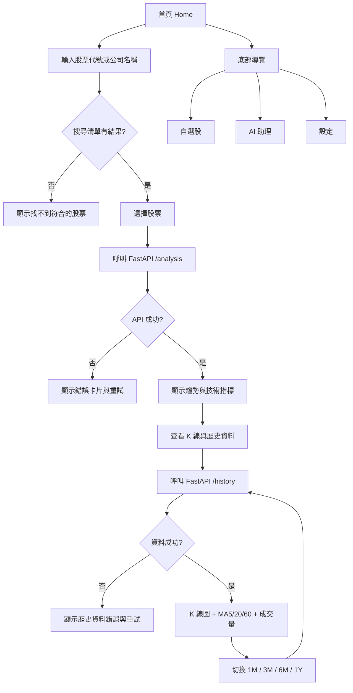

# AI 股票分析 App 頁面流程

```mermaid
flowchart TD
    A[首頁 Home] --> B[輸入股票代號或公司名稱]
    B --> C{搜尋清單有結果?}
    C -- 否 --> D[顯示找不到符合的股票]
    C -- 是 --> E[選擇股票]
    E --> F[呼叫 FastAPI /analysis]
    F --> G{API 成功?}
    G -- 否 --> H[顯示錯誤卡片與重試]
    G -- 是 --> I[顯示趨勢與技術指標]
    I --> J[查看 K 線與歷史資料]
    J --> K[呼叫 FastAPI /history]
    K --> L{資料成功?}
    L -- 否 --> M[顯示歷史資料錯誤與重試]
    L -- 是 --> N[K 線圖 + MA5/20/60 + 成交量]
    N --> O[切換 1M / 3M / 6M / 1Y]
    O --> K
    A --> P[底部導覽]
    P --> Q[自選股]
    P --> R[AI 助理]
    P --> S[設定]
```
